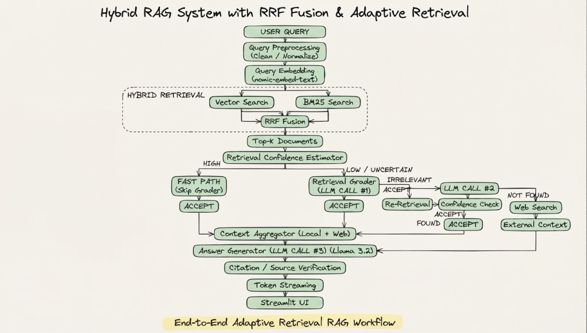

# 🔬 ResearchCRAG: Research Paper CRAG Assistant

An advanced **Corrective Retrieval-Augmented Generation (CRAG)** assistant tailored for AI/ML computer vision and deep learning research papers (e.g., YOLO, Adverse Weather, Object Detection in Fog/Night, Dark Channel Prior, Image Dehazing).

Unlike naive RAG systems that blindly trust initial vector retrieval, **ResearchCRAG** actively evaluates retrieval confidence. For high-confidence matches, it takes a **⚡ Fast Path** to generate immediate answers. For uncertain or irrelevant retrievals, it executes a **self-correcting loop**: an LLM Grader evaluates candidate chunks, triggers an academic **Query Rewriter**, runs **Re-Retrieval**, and falls back to **Web Search** before synthesizing a grounded response with verified citations and real-time token streaming.

---

## 🧠 System Architecture Pipeline

<p align="center">
  
</p>

<details>
<summary><b>View ASCII Flowchart Schema</b></summary>

```text
                         ┌─────────────────┐
                         │    USER QUERY   │
                         └────────┬────────┘
                                  ↓
                    ┌─────────────────────────┐
                    │   Query Preprocessing   │
                    │  Clean / Normalize      │
                    └────────────┬────────────┘
                                 ↓
                    ┌─────────────────────────┐
                    │    Query Embedding      │
                    │    nomic-embed-text     │
                    └────────────┬────────────┘
                                 ↓
              ┌────────────────────────────────────┐
              │          HYBRID RETRIEVAL           │
              │                                    │
              │  ┌────────────┐   ┌────────────┐  │
              │  │Vector      │   │BM25        │  │
              │  │Search      │   │Search      │  │
              │  └─────┬──────┘   └─────┬──────┘  │
              │        └────────┬────────┘         │
              │                 ↓                  │
              │          RRF Fusion                │
              └────────────────┬───────────────────┘
                               ↓
                     Top-K Documents
                               ↓
                ┌──────────────────────────┐
                │ Retrieval Confidence     │
                │        Estimator          │
                └────────────┬─────────────┘
                             ↓
                    ┌────────┴────────┐
                    ↓                 ↓
                  HIGH          LOW / UNCERTAIN
                    ↓                 ↓
             ┌─────────────┐   ┌─────────────────┐
             │ FAST PATH    │   │ Retrieval Grader│
             │ Skip Grader  │   │   LLM CALL #1   │
             └──────┬───────┘   └────────┬────────┘
                    │                    ↓
                    │             ┌──────┴──────┐
                    │             ↓             ↓
                    │           RELEVANT     IRRELEVANT
                    │             ↓             ↓
                    │          ACCEPT      Query Rewriter
                    │                           │
                    │                       LLM CALL #2
                    │                           ↓
                    │                    Re-Retrieval
                    │                           ↓
                    │                    Confidence Check
                    │                           ↓
                    │                    ┌──────┴──────┐
                    │                    ↓             ↓
                    │                  FOUND        NOT FOUND
                    │                    ↓             ↓
                    │                 ACCEPT      Web Search
                    │                                  ↓
                    │                            External Context
                    │                                  ↓
                    └──────────────────┬───────────────┘
                                       ↓
                              ┌───────────────────┐
                              │ Context Aggregator│
                              │ Local + Web       │
                              └─────────┬─────────┘
                                        ↓
                              ┌───────────────────┐
                              │ Answer Generator  │
                              │   LLM CALL #3     │
                              │     Llama 3.2     │
                              └─────────┬─────────┘
                                        ↓
                              ┌───────────────────┐
                              │ Citation / Source │
                              │ Verification      │
                              └─────────┬─────────┘
                                        ↓
                                Token Streaming
                                        ↓
                              ┌───────────────────┐
                              │   Streamlit UI    │
                              └───────────────────┘
```
</details>

---

## 🛠️ Technology Stack

| Component | Technology | Description |
| :--- | :--- | :--- |
| **Backend Framework** | FastAPI + Uvicorn | High-performance asynchronous REST & SSE streaming API |
| **Frontend UI** | Streamlit | Chat interface with live token streaming and citation expanders |
| **Local LLM Engine** | Ollama | Local inference with `llama3.2` and `nomic-embed-text` |
| **Vector Store** | ChromaDB | Persistent dense vector indexing with cosine similarity |
| **Lexical Search** | Rank-BM25 | Inverted index search fused via Reciprocal Rank Fusion (RRF) |
| **Document Ingestion** | PyMuPDF (`fitz`) | Academic paper PDF parsing, header detection, and chunking |
| **Workflow State Machine** | LangGraph | Modular DAG-based Corrective RAG pipeline execution |
| **Web Fallback** | DuckDuckGo Search | Academic web knowledge fallback for out-of-domain queries |

---

## 🚀 Quick Start Guide

### 1. Install Dependencies
```bash
pip install -r requirements.txt
```

### 2. Verify Ollama Models
Ensure Ollama is running with the required models installed:
```bash
ollama pull llama3.2
ollama pull nomic-embed-text
```

### 3. Generate & Ingest Sample Research Papers
```bash
PYTHONPATH=. python3 scripts/seed_sample_papers.py
PYTHONPATH=. python3 scripts/ingest_papers.py
```

### 4. Start the FastAPI Backend
```bash
PYTHONPATH=. uvicorn app.main:app --host 0.0.0.0 --port 8000 --reload
```
- Interactive Swagger API docs: [http://localhost:8000/docs](http://localhost:8000/docs)

### 5. Start the Streamlit Frontend
```bash
streamlit run frontend/streamlit_app.py
```
- Web Application: [http://localhost:8501](http://localhost:8501)

---

## 📋 API Reference

| Method | Endpoint | Description |
| :--- | :--- | :--- |
| `GET` | `/api/health` | System health, Ollama status, model list, and ChromaDB count |
| `POST` | `/api/query` | Standard single-response CRAG query execution |
| `POST` | `/api/query/stream` | Server-Sent Events (SSE) real-time token streaming with trace |
| `POST` | `/api/upload` | Upload and index any AI/ML PDF paper into ChromaDB |
| `GET` | `/api/papers` | List all indexed papers, page counts, and chunk statistics |
| `DELETE` | `/api/papers/{name}` | Delete an indexed paper and remove its vector embeddings |
| `POST` | `/api/evaluate` | Benchmark evaluation comparing Naive RAG vs Corrective RAG |

---

## 📊 Feature Comparison: Naive RAG vs ResearchCRAG

| Feature | Naive RAG | ResearchCRAG |
| :--- | :---: | :---: |
| **Hybrid Search** | ❌ Vector-only | ✅ Dense Vector + BM25 Lexical + RRF Fusion |
| **Confidence Fast-Path** | ❌ No | ✅ High-confidence instant synthesis bypass |
| **Relevance Grading** | ❌ None | ✅ Batch LLM Document Relevance Grader |
| **Query Reformulation** | ❌ None | ✅ Academic Query Rewriter on low relevance |
| **Web Search Fallback** | ❌ None | ✅ DuckDuckGo academic fallback |
| **Citation Grounding** | ⚠️ Generic | ✅ Strict in-text page citations `[Paper, Page X]` |
| **Anti-Hallucination** | ❌ Unchecked | ✅ Post-generation citation verification |
| **Token Streaming** | ⚠️ Blocking | ✅ Low-latency SSE real-time streaming |

---

## 🧪 Running Automated Tests

Run the complete test suite across ingestion, chunking, retrieval, pipeline, and API endpoints:
```bash
PYTHONPATH=. pytest tests/
```
